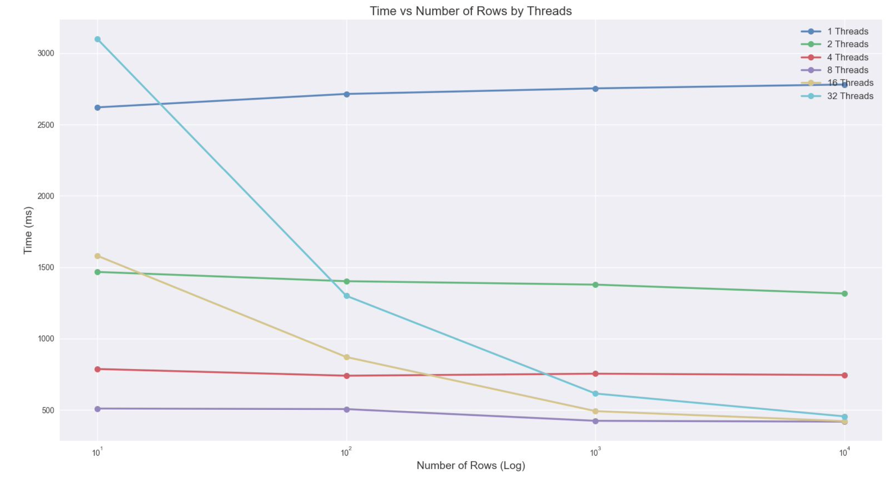

# Final Project - Repeatable Read and Read/Write Locking for a Database and Comparing the Performance to Sequential Transactions
By: Almog Cohen and Rojan Karn

### Final Presentation slides overviewing this project in "Final Presentation.pdf"

## Project Introduction
The goal of this project is to create a database system that allows for basic commands and transactions with repeatable read. Each transaction will support repeatable read and read/write locking to ensure transaction isolation. Each transaction will run independently on a separate thread pool and SIMD instructions will be used to search through the database efficiently. Transactions will support read/write operations, if/else statements, and select statements.


## Program Structure
### Database Implementation

Struct DatabaseTableSchema and is used to store the schema of a database table. The schema contains the number of columns in the table, the names of the columns, and the types of the columns.

The class DatabaseTable is used to store data in columnCount arrays, with each array having size rowCount. The class includes several member functions for manipulating the data, including insert(), which adds a new row of data to the table in the order of the schema, print(), which prints the data in a tabular format, getColumn(), which returns an entire column of data, and getStringColumn() and getIntColumn(), which return a specific string or integer value from a column.

### ReadWriteLockingTable

The ReadWriteLockingTable class provides read and write locking on unique IDs. It is designed to be used in a multithreaded environment where multiple threads may concurrently access and modify the data structure. This class uses an unordered map to store a table of IDs and their associated read and write locking information. The class provides functions to determine whether an ID is currently read or write locked, as well as functions to lock and unlock read and write access to the specified ID. If an ID is not already in the table when attempting to lock it, it will be added to the table and locked.

The ReadWriteLockingTable class is an essential tool for ensuring that data is protected when multiple threads try to access it concurrently. It provides a way for threads to acquire a lock on an ID, allowing them to read or write data associated with that ID, while preventing other threads from modifying the same data until the lock is released. This class provides an efficient and flexible way to manage concurrent access to data, making it ideal for use in applications such as databases, file systems, and network servers.

### query.h

Provides functionality to parse and execute custom queries on a database. The custom query language provides basic commands to interact with a database and manipulate data. The query language has commands like begin_tx, commit_tx, abort_tx, readId, readVal, write, print, arithmetic operators, comparison operators, and conditional statements.

The parseQuery function is the main function that parses the query and executes it. It uses other helper functions like split, strip, contains, evaluateExpression, and executeFunction to carry out its tasks. split function works similar to the split function in Python, strip function works similar to the strip function in Python, and contains function checks if a string sequence is present in another string. evaluateExpression function evaluates a given expression using the variables and their values. executeFunction function executes the given function call and its arguments.


## Prerequisites
1. immintrin library
2. g++ compiler with C++ version 11

## Usage
### Multi Threading
The number of threads used to run the program can be changed by editing the line in main.cpp:
```
#define NUM_WORKER_THREADS <number of threads>
```

### Number of Rows
The number of rows that is generated in the database can be changed bt editing this line in main.cpp:
```
#define MAX_ID 100000
```

### Compile/Run
To compile and run the program, use the following command.
```
g++ main.cpp -mavx2 -std=c++11 && ./a.out
```

## Results
To see the results, please use the `performance-results` branch as it is optimized to colelct the data.

The results were run on 100,000 transactions reading/writing to one element.
### Raw Results

| Threads | Number of DB rows | Time in ms |
|------------------:|-------------------------:|-----------:|
|                 1 |                       10 |       2621 |
|                 1 |                      100 |       2715 |
|                 1 |                     1000 |       2754 |
|                 1 |                    10000 |       2781 |
|                 2 |                       10 |       1467 |
|                 2 |                      100 |       1402 |
|                 2 |                     1000 |       1378 |
|                 2 |                    10000 |       1316 |
|                 4 |                       10 |        787 |
|                 4 |                      100 |        740 |
|                 4 |                     1000 |        754 |
|                 4 |                    10000 |        745 |
|                 8 |                       10 |        510 |
|                 8 |                      100 |        506 |
|                 8 |                     1000 |        424 |
|                 8 |                    10000 |        418 |
|                16 |                       10 |       1581 |
|                16 |                      100 |        871 |
|                16 |                     1000 |        492 |
|                16 |                    10000 |        422 |
|                32 |                       10 |       3102 |
|                32 |                      100 |       1300 |
|                32 |                     1000 |        615 |
|                32 |                    10000 |        455 |


### Compiled Results



### Hardware Environment

| Property | Value |
| -------- | ----- |
| CPU Model | Intel(R) Core(TM) i9-9880H CPU @ 2.30GHz |
| # Cores | 8 Cores |
| # Threads | 16 Threads |
| Max Turbo Frequency | 4.80 GHz |
| Base Frequency | 2.30 GHz |
| Cache L1 | 64K (per core)
| Cache L2 | 256K (per core)
| Cache L3 | 16MB (shared)
| RAM | 32GB DDR4 2666 MHz |

## Analysis and Conclusion
Looking at the data reveals that running transactions sequentially works well for low cardinality databases, as the execution times remain relatively stable across different thread counts. This can be attributed to the lower probability of collisions and contention in databases with few unique elements. On the other hand, for high cardinality databases, increasing the number of threads improves performance, as indicated by decreasing execution times. This decrease signifies a reduced likelihood of collisions and contention, resulting in faster transaction processing. However, it's important to note that there is a limit to the benefits of increasing thread count, as too many threads can introduce significant context switching overhead, which can degrade performance. In this specific scenario, the results indicate that an optimal thread count of 16 provided the best performance, striking a balance between reducing contention and minimizing context switching overhead.
