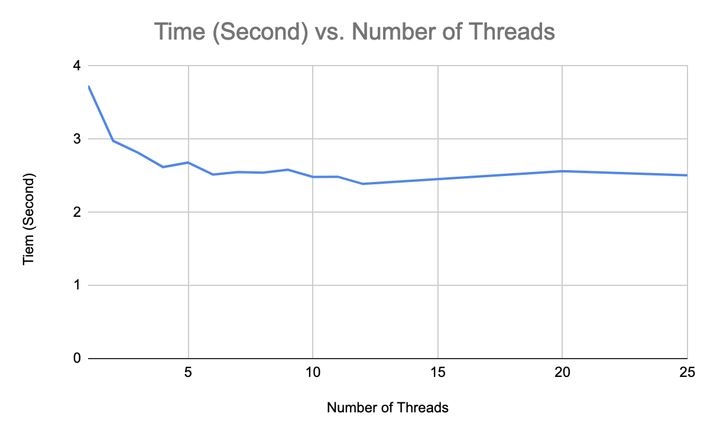

# Project 1: Programming with Multiple Threads (C++)
By: Almog Cohen and Rojan Karn


## Project Introduction

This project aims to provide hands-on experience in multithreading by implementing a C++ module that utilizes multiple threads to compress an input data stream. The compression is achieved by utilizing the open-source ZSTD library (https://facebook.github.io/zstd/). The module will divide the input data stream into 16KB blocks and compress them individually. The compressed blocks will be written to the output file in the same order as the input data stream. The project will use one thread for reading the input data, dispatching the blocks to worker threads for compression, receiving the compressed blocks from worker threads and writing them to the output file. The goal is to demonstrate the ability to implement multithreading in a real-world application.


## Program Structure
This program is designed to take in a file and compress it using the Zstandard library. The program creates 1 worker thread that reads the data in 16 KB chunks and launches multiple worker threads to compress the data. The worker threads then write the compressed data to a file in the same order as the original data.

The program uses a WorkerThread class to manage the worker threads. The class has methods for launching, joining and checking if the thread has completed execution.

The program uses the compressBufferData function to compress the input buffer, puts the compressed data into the WorkerThread's output buffer, and provides the compressedSize for that data.

The compressed data is stored in an array of output buffers, parallel to an array of compressed data sizes. Each WorkerThread has an "id" which keeps track of what order the data is being compressed. In order to ensure that the data is being written in the same order that it was read, all output buffers are placed in the array's index corresponding to its WorkerThread's id.

```
// Add the output buffer to the vector in position id
compressed_data_output_buffers[worker_threads[i]->getID()] = output_buffer;
```

The data is then written (in order) to the output file (compressed_data.zst).

The program prints the input file size, the output (compressed) file size, and the duration of the program.

## Prerequisites
1. ZSTD Library
2. g++ compiler with C++ version 11

## Usage
The program takes a single command-line argument, the name of the input file.

The program is designed to be compiled and executed using the following command:
```
g++ -std=c++11 -lzstd compress.cpp && ./a.out <input file name>
```

The output will be written to a file named "compressed_data.zst" in the current working directory.

The program uses a single thread to read data from the file, dispatch 16KB blocks to other worker threads for compression, receive compressed blocks from other worker threads, and write compressed blocks (in the correct order) to the output file.

It is important to note that the program uses the ZSTD library and it should be installed on the system before executing the program, otherwise the compilation will fail.

### Changing number of threads
The number of worker threads used at a given time can be changed by modifying `#define NUM_WORKER_THREADS 6` to any number of the users choosing. 

## Experimental Results

The 1GB file used can be downloaded at [testfiledownload.com](https://testfiledownload.com/).

### Raw Data

| File Size    | Number of Threads | Time (seconds) |
| ------------ | ----------------- | -------------- |
| 1 GB (1GB.bin)| 1                 | 3.7311         |
|               | 2                 | 2.97724        |
|               | 3                 | 2.81528        |
|               | 4                 | 2.6185         |
|               | 5                 | 2.68           |
|               | 6                 | 2.51608        |
|               | 7                 | 2.55073        |
|               | 8                 | 2.54199        |
|               | 9                 | 2.58192        |
|               | 10                | 2.4839         |
|               | 11                | 2.48658        |
|               | 12                | 2.38829        |
|               | 20                | 2.56261        |
|               | 25                | 2.50524        |

### Graphical Representation



### Hardware Environment

| Property | Value |
| -------- | ----- |
| CPU Model | Intel(R) Core(TM) i9-9880H CPU @ 2.30GHz |
| # Cores | 8 Cores |
| # Threads | 16 Threads |
| Max Turbo Frequency | 4.80 GHz |
| Base Frequency | 2.30 GHz |
| Cache L1 | 64K (per core)
| Cache L2 | 256K (per core)
| Cache L3 | 16MB (shared)
| RAM | 32GB DDR4 2666 MHz |

## Analysis and Conclusion

The data shows a clear trend of decreasing processing time as the number of threads used for processing a 1 GB file (1GB.bin) increases. The fastest processing time recorded was 2.38829 seconds, achieved when utilizing 12 threads. 

However, it is important to note that the benefits of utilizing additional threads appear to plateau around 8-12 threads. Beyond this point, increasing the number of threads does not result in a significant decrease in processing time. For example, at 25 threads, the processing time is still 2.50524 seconds, which is slower than the time achieved with 12 threads. 

These findings suggest that for optimal performance, a balance should be struck between the number of threads utilized and the resulting processing time.  It is important to note that the number of threads that can be effectively utilized is limited by the hardware being used, as most computers can only run a certain number of threads simultaneously.
