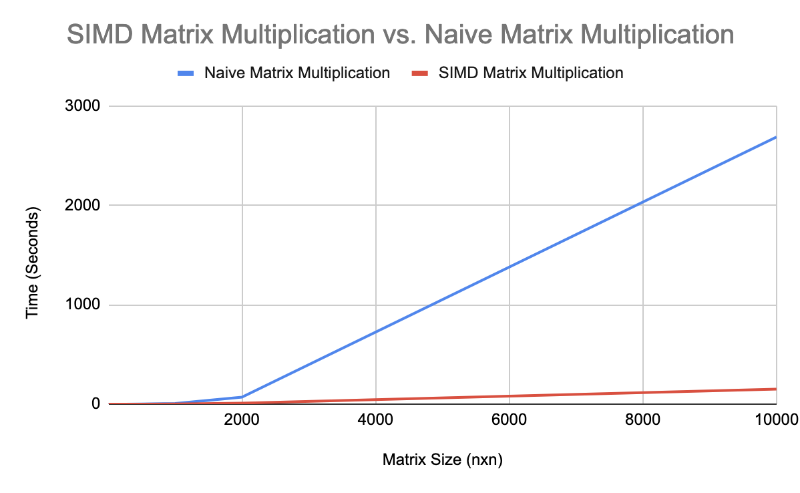

# Project 2: Matrix-Matrix Multiplication with SIMD Instructions & Cache Miss Minimization
By: Rojan Karn and Almog Cohen

## Project Introduction
This project implements a C/C++ module that carries out high-speed matrix-matrix multiplication by explicitly utilizing x86 SIMD instructions and minimizing cache miss rate via restructuring data access patterns. Matrix-matrix multiplication is a key data processing kernel in many real-life applications, such as machine learning, computer vision, signal processing and scientific computing. The project demonstrates the importance of exploiting data-level parallelism and minimizing cache miss rate.

## Program Structure
The program implements a comparison between two algorithms for matrix multiplication: a naive approach and a SIMD (Single Instruction Multiple Data) method using the AVX2 instruction set. The program inputs two matrices from designated files, performs matrix multiplication, and then outputs the calculation time for each algorithm and, if required, the result of the calculation. Written in C++, the program leverages several libraries including our custom built Matrix class that stores the matrix as a 2D array, the chrono library for measuring time, and the immintrin.h library for accessing the AVX2 instructions. The program consists of a main function that manages the command line arguments, calls the matrix multiplication functions, and displays the results, as well as several supporting functions that perform the matrix multiplication and print the AVX2 variables. Our custom-built Matrix class represents matrices as 2D arrays. To ensure optimal performance with SIMD __m256, which reads 8 values at once, the matrix is padded with zeros to make its size a multiple of 8.

## Prerequisites
1. immintrin library
2. g++ compiler with C++ version 11

## Usage
### Example Usage
Below is an example to compile and run the program
```
g++ MatrixMultiplication.cpp -mavx -std=c++11 -o MatrixMultiplication.out && ./MatrixMultiplication.out MATRIX_3_INT.txt MATRIX_3_INT.txt -print
```

* The `-print` is optional and will print the result of the multiplication in the terminal.
* IT IS NOT RECOMMENDED TO USE THIS ON THE 1000x1000 MATRICES AS IT WILL OUTPUT A LOT TO YOUR TERMINAL


The program can be run from the command line by specifying the two input matrix files and the optional "-print" flag. The format for running the program is as follows:

```
./MatrixMultiplication.out <matrix_a_filename> <matrix_b_filename> [-print]
```

* `<matrix_a_filename>` and `<matrix_b_filename>` represent the names of the two input matrix files that you wish to multiply. These files should contain the numerical values for the matrices in the appropriate format.

* The `-print` flag is an optional parameter that, when included, will cause the program to print the result of the matrix multiplication to the console. If this flag is not included, the result will not be printed.

### Generating Matrices
The `1000x1000` and `10000x10000` matrices can be generated using the custom python script. The `.txt` files it generates are over 100 MB and as such cannot be uploaded to GitHub.
```
python3 GenerateMatrix.py
```

### Matrix Format
An example format of the input matrix.txt file is
```
3
1 2 3
4 5 6
7 8 9
```
This specifics a 3x3 matrix with 1 2 3 in the first row, 4 5 6 in the second row, and 7 8 9 in the third row.

## Experimental Results

The comparison between the SIMD instruction and naive matrix multiplication was tested on a 3x3, 10x10, 50x50, 100x100, 250x250, 500x500, 1000x1000, 2000x2000, 5000x5000, and 10000x10000 matrices.

### Raw Data

| Matrix Size (nxn) | SIMD Matrix Multiplication (seconds) | Naive Matrix Multiplication (seconds) |
| ------------ | ----------------- | -------------- |
| 3 | 0 | 0 |
| 10 | 0 | 0 |
| 50 | 0 | 0 |
| 100 | 0.001 | 0.003 |
| 250 | 0.017 | 0.076 |
| 500 | 0.142 | 0.622 |
| 1000 | 1.256 | 5.344 |
| 2000 | 9.665 | 69.751 |
| 10000 | 151.3 | 2687.129 |

### Graphical Representation



### Hardware Environment

| Property | Value |
| -------- | ----- |
| CPU Model | Intel(R) Core(TM) i9-9880H CPU @ 2.30GHz |
| # Cores | 8 Cores |
| # Threads | 16 Threads |
| Max Turbo Frequency | 4.80 GHz |
| Base Frequency | 2.30 GHz |
| Cache L1 | 64K (per core)
| Cache L2 | 256K (per core)
| Cache L3 | 16MB (shared)
| RAM | 32GB DDR4 2666 MHz |

## Analysis and Conclusion

Based on the data presented in the chart, it can be seen that the SIMD (Single Instruction, Multiple Data) version of matrix multiplication is significantly faster than the naive matrix multiplication algorithm. This is because the SIMD version is able to run 8 operations simultaneously, making efficient use of the available processing power. Additionally, the SIMD version also includes cache optimizations, which help to further improve its performance by reducing the number of times it has to access slower main memory. As a result, the SIMD version is able to perform matrix multiplications much more quickly than the naive algorithm, which can be seen for the large 5000x5000 and 10000x10000 matrices. In conclusion, the use of SIMD and cache optimizations has a significant impact on the performance of matrix multiplications, making it a highly efficient and effective solution.
