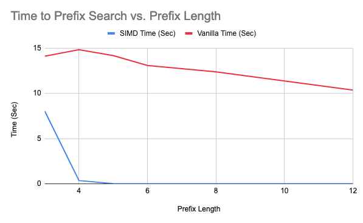

# Project 4 - Implementation of Dictionary Codec
By: Almog Cohen and Rojan Karn

## Project Introduction
A dictionary codec is a data compression technique used to reduce the data footprint and speed up search/scan operations on data with low cardinality. Dictionary encoding involves scanning the data to create a dictionary of unique data items and replacing each item with its dictionary ID. This project will use a custom Prefix Tree (or trie) data structure to accelerate dictionary look-up and apply SIMD instructions to further speed up search/scan operations. By implementing this technique, the project will contribute to the optimization of real-world data analytics systems.

This project constructs a dictionary structure by building a prefix tree. Each node on the prefix tree represents a single character, and its children are the next character in the word. For instance, the word "apple" would be represented as a -> p -> p -> l -> e in the tree. To find a word, one must traverse the tree a maximum of n times, where n is the number of letters in the word. Once the tree is complete, each word in the vector is traversed and encoded into an integer for compression. For each thread used, a separate prefix tree is created for that chunk. Suppose the file contains 100 lines, and there are 2 threads. In that case, thread 1 creates a prefix tree of the first 50 lines, and thread 2 creates a prefix tree of the last 50 lines. After all threads complete their tasks, the trees are efficiently combined into one major prefix tree.

To search for a word, the word is converted into its encoded mapping by traversing the tree. To find all indices of the word in the original vector, SIMD instructions are used to compare eight words in the encoded vector simultaneously. This operation returns a bitmask that, if any bits in the byte are 1, indicates a valid match, and the indices are added to the list. Searching for a prefix works similarly, where the prefix is traversed on the tree, and all recursive children nodes that are isWord equal to true are returned in the encoded version. Then, the SIMD instructions compare each encoded version to all in the encoded list to see if they match.

The vanilla search does not utilize SIMD or multi-threading. Instead, it reads the entire file into memory as a vector and searches for the substring to check if it is equal for the prefix. Similarly, it checks if the word is equal for search and marks the found index.

## Program Structure
### PrefixTree.h
The PrefixTreeNode class represents a single node in a prefix tree, which is a tree data structure used for efficiently storing and searching for strings. The PrefixTreeNode class contains a character value, a boolean flag to indicate if the node represents the end of a word, and a vector of child nodes (for each character in the alphabet). It also provides methods for adding and retrieving child nodes, as well as for printing the node and checking if a particular character has a child node.

The PrefixTree class represents the overall prefix tree data structure, and contains a root node of type PrefixTreeNode. It provides methods for inserting words into the tree (which returns an encoded index of the word), searching for words (which returns all indices of the word in the original file), searching for prefixes (which returns a vector of pairs of all words in the tree that start with the prefix and their indices), and merging another prefix tree into this one. The class also includes two search methods that are designed to make use of SIMD instructions for faster searching.

### Main Program
The program is designed to read in a file and build a prefix tree data structure from its contents. The prefix tree is used to search for prefixes and complete words within the file.

The program reads in a file, converts all text to lowercase, and stores each line in a vector of strings. This vector is then divided into multiple smaller vectors, with each vector assigned to a separate worker thread. Each worker thread is responsible for building a separate prefix tree based on the lines assigned to it. Once all the worker threads have completed building their individual prefix trees, they are merged together into one large prefix tree which represents the dictionary.

There are also functions defined for performing a "vanilla" search of the file for a specific prefix or word. The vanillaSearchPrefix() function performs a simple prefix search of the file, while the vanillaSearchWord() function performs a simple word search. These functions are used as a baseline for comparison against the prefix tree search.

Once the Prefix Tree is built and ready to search, a user interface comes up in the terminal prompting the user to search/scan the dictionary. They can choose to either search for an entire word or search for a prefix. After they entire their word/prefix, the program prints out the indices that the word/prefix appears at in the input file. It also prints out the time it took for the search/scan operation to complete. This user interface continues to run for the user to search for multiple words until the user prompts the program to quit.

## Prerequisites
1. immintrin library
2. g++ compiler with C++ version 11

## Usage
### Multi Threading
The number of threads used to run the program can be changed by editing the line in main.cpp:
```
#define NUM_WORKER_THREADS <number of threads>
```

### Compiling and Running
The program can be run in two different modes: vanilla or optimized. Vanilla mode does not make use of the Prefix Tree or multi-threading and instead simply performs the search/scan operations iteratively. Vanilla mode provides the baseline performance values that the optimized performance will be compared against.
Optimized mode uses the Prefix Tree data structure and multi-threading to perform the search/scan operations. This mode will showcase the efficiency improvements from vanilla mode.

To compile and run the program in **optimized** mode:
```
g++ main.cpp -std=c++11 -mavx2 && ./a.out <INPUT_FILE.txt>
```

To compile and run the program in **vanilla** mode:
```
g++ main.cpp -std=c++11 -mavx2 && ./a.out <INPUT_FILE.txt> -mode vanilla
```

## Experimental Results
The vanilla mode does not make use of SIMD instructions for searching prefixes. All tests were performed on the given `Column.txt` file of 1 GB in size. Prefixes of length 2 or less were not tested due to time constraints with prefix tree.

### Raw Data
**Time to Create Dictionary Encoding (Prefix Tree) vs. Threads**
| Num of Threads | Time (Sec) |
| :------------: | :--------: |
|       1        |    186     |
|       4        |     70     |
|       8        |     59     |
|      16        |    100     |

**Single Random Word Search (average of 100 runs)**
|  Type   | Time (Sec) |
| :-----: | :--------: |
|  SIMD   |  0.181973  |
| Vanilla |  6.25159   |

**Time to Prefix Search vs. Prefix Length (average of 100 runs)**
| Prefix Length | SIMD Time (Sec) | Vanilla Time (Sec) |
| :-----------: | :------------: | :---------------: |
|       3       |     8.04678    |      14.1152      |
|       4       |    0.356513    |      14.8271      |
|       5       |   0.0156622    |      14.1725      |
|       6       |  0.00000268    |      13.0844      |
|       8       |  0.000002916   |      12.3888      |
|      12       | 0.00000219756  |      10.3623      |

### Compiled Data


**Single Random Word Search (average of 100 runs)**
|  Type   | Time (Sec) |
| :-----: | :--------: |
|  SIMD   |  0.181973  |
| Vanilla |  6.25159   |



### Hardware Environment

| Property | Value |
| -------- | ----- |
| CPU Model | Intel(R) Core(TM) i9-9880H CPU @ 2.30GHz |
| # Cores | 8 Cores |
| # Threads | 16 Threads |
| Max Turbo Frequency | 4.80 GHz |
| Base Frequency | 2.30 GHz |
| Cache L1 | 64K (per core)
| Cache L2 | 256K (per core)
| Cache L3 | 16MB (shared)
| RAM | 32GB DDR4 2666 MHz |

## Analysis and Conclusion

As seen in the first graph, the time taken to encode the dictionary increases with an increase in the number of threads. However, there comes a point where increasing the number of working threads yields diminishing results. This can be attributed to the fact that beyond a certain number of cores, the performance worsens due to the context switching required between threads. Therefore, in our tests, we found that 4 to 8 threads were ideal.

Using SIMD to search for a word and conduct prefix checks significantly sped up the performance compared to the vanilla search. Given that we are using a prefix tree structure, the longer the prefix, the faster the search can be conducted. In this case, after a prefix length of 4, the time to search became less than a millisecond. For vanilla, the prefix time always took around 14 seconds regardless of length. This is because the vanilla must search through every element and every character to check if there is a match. However, the vanilla does speed up a little bit at the end because as the prefix length gets larger, for most words, no checking of the characters needs to be done. Overall, adding the prefix tree with the SIMD instructions sped up the search from 14 seconds to milliseconds.

Our lab experiment demonstrated that the optimal number of working threads for encoding a dictionary is between 4 to 8. Beyond this range, the increase in the number of cores results in diminishing returns due to the context switching required between threads. Furthermore, we found that using SIMD instructions with a prefix tree structure for searching significantly improved performance compared to the vanilla search. The longer the prefix length, the faster the search could be conducted, with a time of less than a millisecond achieved after a prefix length of 4. Overall, our experiment highlights the importance of optimizing the stroage data structure, using threads, and utilizing SIMD instructions to achieve faster processing times with lower storage requirements.
